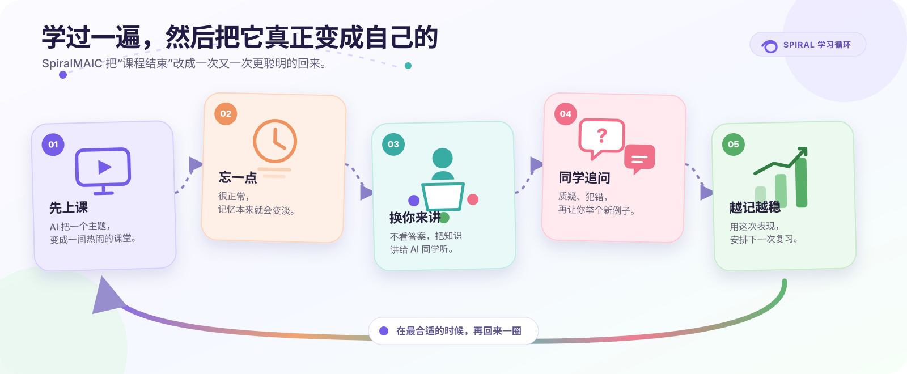

<p align="center">
  
</p>

<p align="center">
  <strong>学一遍。忘一点。再讲回来。然后真的记住。</strong>
</p>

<p align="center">
  <a href="https://github.com/YizukiAme/SpiralMAIC/actions/workflows/ci.yml"></a>
  <a href="LICENSE"></a>
</p>

<p align="center">
  <a href="README.md">English</a> · <a href="README-zh.md">简体中文</a>
</p>



## 课结束了，记忆可没结束

大多数 AI 课堂都是一次性的：生成一门课，上完，关掉，然后再也想不起它躺在哪。

**SpiralMAIC 想给课堂续个命。** 它记得这堂课讲了什么，也允许记忆自然变淡；等到真的值得
回来复习时，再把你叫回来。然后剧情反转：AI 不讲了，**这次换你坐到老师的位置上。**

## AI 同学已经准备好为难你了

进入 **Reverse Challenge**，你会对着一份故意写得很简略的复习骨架，用自己的话把知识
讲回来。AI 同学会认真听，也会追问、故意犯错、让你换个例子；真卡住了，AI 助教再出来
搭把手——只救场，不抢答。

而且这不是一个孤零零的题库，也不是套了皮的聊天框。它就发生在原来的课堂播放器里。

> 幻灯片上没有标准答案，也没有蒙一个选项就跑的机会。只有你、这个概念，和几位
> 好奇得有点过分的 AI 同学。

## 它首先得是一间真的 AI 课堂

<table>
  <tr>
    <td width="33%"></td>
    <td width="33%"></td>
    <td width="33%"></td>
  </tr>
  <tr>
    <td align="center"><strong>知识先变成好课件</strong></td>
    <td align="center"><strong>老师同学都到场</strong></td>
    <td align="center"><strong>该互动时真的能动</strong></td>
  </tr>
</table>

幻灯片、测验、互动场景、PBL、白板、语音、编辑和导出都还在。SpiralMAIC 只是坚决
不让这些东西在“课程完成”之后开始吃灰。

## 一圈大概是这样

1. **先上正课。** 从一个主题、PDF 或其他材料开始。
2. **过一阵再回来。** 记忆慢慢变淡，课程卡片也会悄悄换颜色。
3. **交换座位。** 打开 Reverse Challenge，换你给 AI 同学上课。
4. **接受追问。** 疑问、误区、迁移案例，还有有边界的助教救场。
5. **看看哪里真会了。** 得到讲解、解疑、迁移、纠错四个维度的报告。
6. **做下一件最有用的事。** 晚点再复习、回放挑战，或者做一份针对性的教学材料。

## 让这一圈转起来的小东西

- **会呼吸的记忆** —— 每个概念有自己的半衰期，不拿一个“已完成”糊弄整门课。
- **真的有一班同学** —— 每门课自己生成学生和助教，挑战时还是原班人马。
- **评价不是拍脑袋** —— 好和不好都能指回对话、页面和事实错误。
- **教学材料工作台** —— 视觉简报、思维导图、学习指南、FAQ、闪卡、测验，想换口味就换。
- **下课还能加时** —— 再问一个好问题，它可以直接长成一张新课件。
- **Demo 时间机器** —— 快进遗忘过程，但不会把演示数据混进你的正式记录。

## 跑起来

准备 Node.js `>= 20.9.0`、pnpm 10，再选一个云端或本地模型服务。

```bash
git clone https://github.com/YizukiAme/SpiralMAIC.git
cd SpiralMAIC
corepack enable
pnpm install
cp .env.example .env.local
pnpm dev
```

想最快用 API Key 开始，可以在 `.env.local` 放一个模型配置：

```env
OPENAI_API_KEY=sk-...
DEFAULT_MODEL=openai:your-model
```

然后打开 [http://localhost:3000](http://localhost:3000)，生成一门课，开始转第一圈。

Gemini、Anthropic、Bedrock、DeepSeek、Qwen、Kimi、MiniMax、GLM、小米 MiMo、
OpenRouter、Ollama、Lemonade 等也都可以用。最新配置清单直接看 [`.env.example`](.env.example)。

<details>
<summary><strong>Docker、持久化和生产部署</strong></summary>

直接构建生产版本：

```bash
pnpm build
pnpm start
```

或者用 Docker：

```bash
docker compose up --build
```

可选的 PostgreSQL 持久化和隔离 MP4 渲染服务可以通过 Docker Compose profile 开启。
细节见[存储说明](packages/@openmaic/storage/README.md)和
[渲染服务说明](render-service/README.md)。

网络较慢时，可通过 `ALPINE_MIRROR`（Alpine 镜像站主机名）和 `NPM_REGISTRY`
（完整 npm registry URL）加速 Docker 构建：

```sh
ALPINE_MIRROR=mirrors.tuna.tsinghua.edu.cn \
NPM_REGISTRY=https://registry.npmmirror.com \
docker compose up --build
```

只使用公共镜像地址；Docker 可能把构建参数保留在镜像元数据中。

</details>

<details>
<summary><strong>我想拆开看看 / 改点东西</strong></summary>

Spiral 自己的部分很好找：

| 路径 | 里面有什么 |
| --- | --- |
| `app/classroom/[id]/revisit/` | Reverse Challenge 课堂 |
| `components/revisit/` | 复盘面板、报告、教学材料工作台和阅读器 |
| `lib/revisit/` | 记忆、考纲、证据、评分、挑战和本地数据 |
| `lib/overtime/` | 课后加时课件 |
| `eval/revisit-judge/` | 报告稳定性评测 |

常用检查：

```bash
pnpm check
pnpm lint
npx tsc --noEmit
pnpm check:i18n-keys
pnpm test
pnpm build
```

</details>

## License

[MIT](LICENSE)。SpiralMAIC 基于 OpenMAIC 开发，并保留其原有版权说明和署名。
