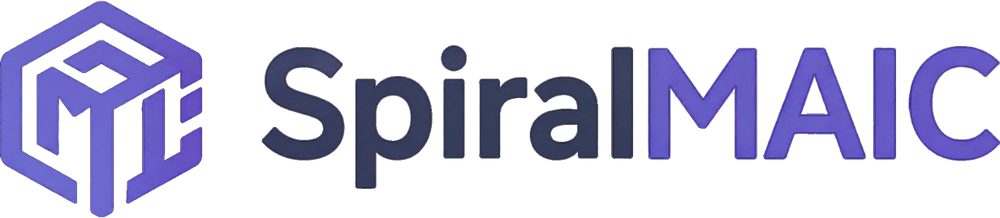
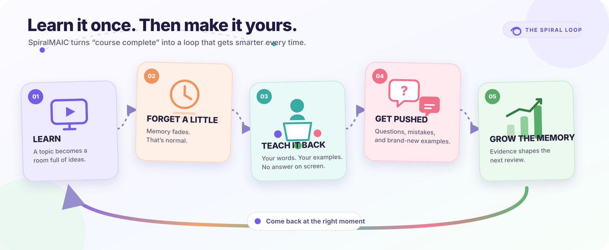

<p align="center">
  
</p>

<p align="center">
  <strong>Learn it. Forget a little. Teach it back. Keep it.</strong>
</p>

<p align="center">
  <a href="https://github.com/YizukiAme/SpiralMAIC/actions/workflows/ci.yml"></a>
  <a href="LICENSE"></a>
</p>

<p align="center">
  <a href="README.md">English</a> · <a href="README-zh.md">简体中文</a>
</p>



## The lesson is over. Your memory isn't.

Most AI classrooms are one-shot: generate a course, finish it, forget where it went.

**SpiralMAIC gives the classroom an afterlife.** It remembers what the course was about,
lets those memories fade naturally, and brings you back when a review would actually help.
Then comes the plot twist: the AI stops teaching. **You take the teacher seat.**

## Your AI classmates are ready to be difficult

In a **Reverse Challenge**, you explain a sparse review deck in your own words. The AI
classmates listen, ask follow-ups, make deliberate mistakes, and request a fresh example.
If things get stuck, an AI assistant can step in—just enough to get the room moving again.

It all happens inside the real classroom player, not in a lonely quiz form or a generic chat box.

> No answer on the slide. No multiple-choice escape hatch. Just you, the idea, and a few
> suspiciously curious AI students.

## It still starts with a proper AI classroom

<table>
  <tr>
    <td width="33%"></td>
    <td width="33%"></td>
    <td width="33%"></td>
  </tr>
  <tr>
    <td align="center"><strong>Ideas become slides</strong></td>
    <td align="center"><strong>Agents join the room</strong></td>
    <td align="center"><strong>Lessons become interactive</strong></td>
  </tr>
</table>

You still get slides, quizzes, interactive scenes, PBL, whiteboard, speech, editing, and
exports. SpiralMAIC simply refuses to let all of that disappear after “Complete.”

## One loop looks like this

1. **Take the course.** Start from a topic, PDF, or other source material.
2. **Come back later.** The course card quietly shifts as estimated recall fades.
3. **Switch seats.** Open Reverse Challenge and teach the review deck back.
4. **Let the room push back.** Questions, misconceptions, transfer examples, and bounded rescue.
5. **See what held up.** Get a report for clarity, doubt resolution, transfer, and correction.
6. **Do the next useful thing.** Review later, replay the room, or spin up a focused study artifact.

## The little things that make the loop work

- **Memory that breathes** — every concept gets its own half-life instead of a blunt course-level checkbox.
- **A real cast** — each classroom carries its own generated students and assistant into the challenge.
- **Evidence, not vibes** — feedback points back to the conversation, passed pages, and factual mistakes.
- **A Study Studio** — make a visual briefing, mind map, study guide, FAQ, flashcards, or quiz.
- **Post-class overtime** — ask one more good question and turn it into a new lesson page.
- **A demo time machine** — fast-forward memory decay without messing up your real learning history.

## Run it

You need Node.js `>= 22.13 < 23`, pnpm 10, and one model provider (cloud or local).

```bash
git clone https://github.com/YizukiAme/SpiralMAIC.git
cd SpiralMAIC
corepack enable
pnpm install
cp .env.example .env.local
pnpm dev
```

For a quick API-key setup, add a provider to `.env.local`:

```env
OPENAI_API_KEY=sk-...
DEFAULT_MODEL=openai:your-model
```

Then open [http://localhost:3000](http://localhost:3000), make a classroom, and start the loop.

There are plenty of other options—Gemini, Anthropic, Bedrock, DeepSeek, Qwen, Kimi,
MiniMax, GLM, Xiaomi MiMo, OpenRouter, Ollama, Lemonade, and more. The always-current list
lives in [`.env.example`](.env.example).

<details>
<summary><strong>Docker, persistence, and production</strong></summary>

Build and run the production app:

```bash
pnpm build
pnpm start
```

Or use Docker:

```bash
docker compose up --build
```

Optional PostgreSQL persistence and the isolated MP4 render service are available through
Docker Compose profiles. See the [storage guide](packages/@openmaic/storage/README.md) and
[render-service guide](render-service/README.md).

Shared deployments should set `ACCESS_CODE`. Local instances remain open when it is unset;
when enabled, a verified browser stays signed in for up to seven days before asking again.
See [the v0.4 upgrade guide](UPGRADING-v0.4.md) for compatibility and rollback notes.

For slow networks, Docker builds accept `ALPINE_MIRROR` (an Alpine mirror hostname) and
`NPM_REGISTRY` (a complete npm registry URL):

```sh
ALPINE_MIRROR=mirrors.tuna.tsinghua.edu.cn \
NPM_REGISTRY=https://registry.npmmirror.com \
docker compose up --build
```

Use public mirrors only; Docker may retain build arguments in image metadata.

</details>

<details>
<summary><strong>I want to hack on it</strong></summary>

The Spiral-specific layer is intentionally easy to find:

| Path | What's inside |
| --- | --- |
| `app/classroom/[id]/revisit/` | The Reverse Challenge classroom |
| `components/revisit/` | Review panel, report, Study Studio, artifact viewers |
| `lib/revisit/` | Memory, blueprints, evidence, judging, attempts, local data |
| `lib/overtime/` | Post-class follow-up lessons |
| `eval/revisit-judge/` | Report stability evals |

Useful checks:

```bash
pnpm check
pnpm lint
pnpm typecheck
pnpm typecheck:e2e
pnpm check:i18n-keys
pnpm test
pnpm build
```

</details>

## License

[MIT](LICENSE). SpiralMAIC is based on OpenMAIC; its original notices and attribution are preserved.
